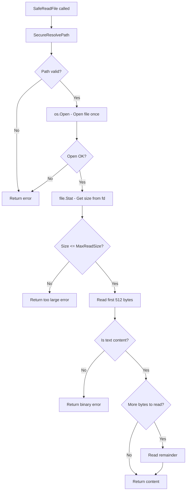

# Refactor SafeReadFile to Optimize I/O Operations

## Problem Statement

Codacy identified a potential path traversal vulnerability at line 507, but the path is already being resolved via `SecureResolvePath`. The real issue is redundant I/O operations in [`SafeReadFile`](internal/fileutil/fileutil.go:486).

### Current Implementation Issues

The current [`SafeReadFile`](internal/fileutil/fileutil.go:486) function performs redundant I/O operations:

```go
func SafeReadFile(path, workingDir string) (string, error) {
    safePath, err := SecureResolvePath(path, workingDir)  // No I/O
    if err != nil {
        return "", err
    }

    info, err := os.Stat(safePath)  // I/O #1: Stat
    if err != nil {
        return "", err
    }

    if info.Size() > MaxReadSize {
        return "", fmt.Errorf("file too large...")
    }

    isText, err := IsTextFile(safePath)  // I/O #2 & #3: Open + Read 512 bytes
    if err != nil || !isText {
        return "", errors.New("file appears to be binary...")
    }

    content, err := os.ReadFile(safePath)  // I/O #4 & #5: Open + Read entire file
    if err != nil {
        return "", err
    }

    return string(content), nil
}
```

**Current I/O Operations:**
| Operation | Count | Description |
|-----------|-------|-------------|
| `os.Stat` | 1 | Get file size |
| `os.Open` | 2 | Open file in IsTextFile and os.ReadFile |
| `Read` | 2 | Read 512 bytes + read entire file |

**Total: 5 I/O operations** (file opened twice, read twice)

## Proposed Solution

Refactor `SafeReadFile` to:
1. Open the file once
2. Get file info from the file descriptor using `file.Stat()`
3. Read the first 512 bytes for content type detection
4. If text file and size OK, read the remainder of the file
5. Combine the initial bytes with the remainder

**Optimized I/O Operations:**
| Operation | Count | Description |
|-----------|-------|-------------|
| `os.Open` | 1 | Open file once |
| `file.Stat()` | 1 | Get file info from fd |
| `Read` | 1-2 | Read 512 bytes, then read remainder if needed |

**Total: 3-4 I/O operations** (file opened once, read once or twice depending on size)

## Implementation Plan

### Step 1: Create Internal Helper Function

Create a new unexported function `isTextFileFromReader` that detects text content from a byte slice:

```go
// isTextFileFromBytes checks if the given bytes represent text content.
// It uses the same logic as IsTextFile but works on already-read bytes.
func isTextFileFromBytes(data []byte) bool {
    contentType := http.DetectContentType(data)
    return strings.HasPrefix(contentType, "text/") || contentType == "application/octet-stream"
}
```

### Step 2: Refactor SafeReadFile

Refactor `SafeReadFile` to use a single file descriptor:

```go
func SafeReadFile(path, workingDir string) (string, error) {
    safePath, err := SecureResolvePath(path, workingDir)
    if err != nil {
        return "", err
    }

    // Open file once
    f, err := os.Open(safePath)
    if err != nil {
        return "", err
    }
    defer f.Close()

    // Get file info from the file descriptor
    info, err := f.Stat()
    if err != nil {
        return "", err
    }

    if info.Size() > MaxReadSize {
        return "", fmt.Errorf("file too large (%d bytes). Max allowed: %d", info.Size(), MaxReadSize)
    }

    // Read first 512 bytes for content type detection
    header := make([]byte, 512)
    n, err := f.Read(header)
    if err != nil && err != io.EOF {
        return "", err
    }
    header = header[:n]

    // Check if text file
    if !isTextFileFromBytes(header) {
        return "", errors.New("file appears to be binary or unsupported format")
    }

    // Read the remainder of the file
    var remainder []byte
    if info.Size() > int64(n) {
        remainder, err = io.ReadAll(f)
        if err != nil {
            return "", err
        }
    }

    // Combine header and remainder
    content := make([]byte, 0, len(header)+len(remainder))
    content = append(content, header...)
    content = append(content, remainder...)

    return string(content), nil
}
```

### Step 3: Keep IsTextFile for Backward Compatibility

The [`IsTextFile`](internal/fileutil/fileutil.go:458) function is only used by `SafeReadFile` internally, but since it's exported, we should keep it for backward compatibility. It can optionally be refactored to use the new helper:

```go
func IsTextFile(path string) (bool, error) {
    f, err := os.Open(path)
    if err != nil {
        return false, err
    }
    defer f.Close()

    buffer := make([]byte, 512)
    n, err := f.Read(buffer)
    if err != nil && err != io.EOF {
        return false, err
    }

    return isTextFileFromBytes(buffer[:n]), nil
}
```

### Step 4: Add Unit Tests

Add comprehensive tests for the refactored function:

```go
func TestSafeReadFile(t *testing.T) {
    tests := []struct {
        name        string
        content     []byte
        expectError bool
        errorMatch  string
    }{
        {
            name:        "small text file",
            content:     []byte("hello world"),
            expectError: false,
        },
        {
            name:        "binary file",
            content:     []byte{0x00, 0x01, 0x02, 0x03, 0xFF, 0xFE},
            expectError: true,
            errorMatch:  "binary",
        },
        {
            name:        "empty file",
            content:     []byte{},
            expectError: false, // Empty files are considered text
        },
        {
            name:        "large text file",
            content:     bytes.Repeat([]byte("a"), 2*1024*1024), // 2MB
            expectError: true,
            errorMatch:  "too large",
        },
    }
    // ... test implementation
}
```

## Flow Diagram



## Benefits

1. **Performance**: Reduces I/O operations from 5 to 3-4
2. **Efficiency**: File opened once instead of twice
3. **Memory**: Can potentially use buffer pooling for large files
4. **Security**: Maintains existing path traversal protection via `SecureResolvePath`

## Files to Modify

- [`internal/fileutil/fileutil.go`](internal/fileutil/fileutil.go) - Main implementation
- [`internal/fileutil/fileutil_test.go`](internal/fileutil/fileutil_test.go) - Add tests

## Testing Strategy

1. Run existing tests to ensure no regression
2. Add new tests for edge cases
3. Run `make test` for final validation
